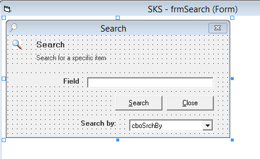

# Salmon King Seafood Reference (SKS) App VB6 

Salmon King Seafood is the fictitiuos company created by the  Brown brothers in the 80s.

To support their business they created a VB6 app, which has helped them to become successful.

# About the App

This app shows some very common VB6 features and controls. The idea of this app is to provide an example to showcase some the solutions for VB6 migration and app modernization from [Mobilize.NET](https://www.mobilize.net)

# What can you see in this app

The **SKS** is a Multiple Document Interface (MDI) VB6 apps.

The main form is the MDI container, and the rest of the forms are triggered from the menu on this mdi container.

When the app starts after an splash window that is hidden using a VB.Timer, the main MDI pops up with the Orden Reception.

This screen uses some standard labels and textboxes and an MSFlexGrid.

From the menu you can trigger some forms like:

or

These screens use a Toolbar, Control Arrays, ImageList and an ADO Data Control (ADODC). The textboxes use data binding to connect with the DB.

There are also screens like:

or 

or 

or 

or

With some events, standard controls, combos and listview controls.

# Technologies used

This application was developed in VB6, it uses mostly the intrinsic VB6 controls 
    - VB.Label
    - VB.CommandButton
    - VB.Combobox
    - VB.Frame
    - MSComCtlLib.ImageList
    - MSComCtlLib.ListView
    - MSComCtlLib.Toolbar
    - MSFlexGridLib.MSFlexGrid

The database used is an **MS Access** Database called `Orders.mdb`

It uses *ADODB* to connect to this MDB and also the ADO Data Controls for databinding and data navigation.

